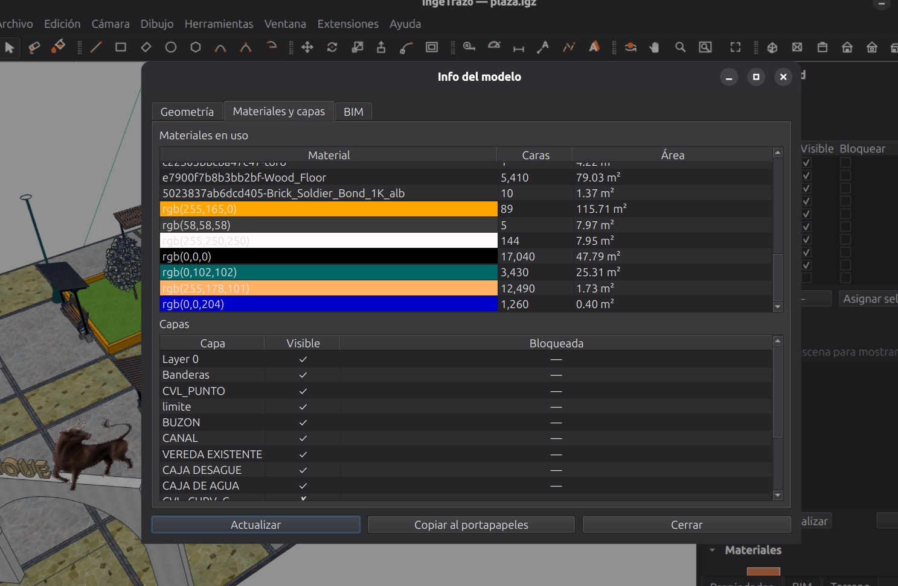
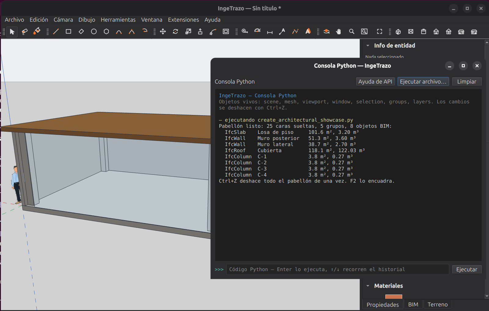

# Extensiones

Desde la versión **0.3.2**, IngeTrazo se puede ampliar con **plugins**: pequeños
programas que agregan herramientas nuevas sin tocar la aplicación. Todo vive en
el menú **Extensiones** de la barra superior.

Varias extensiones vienen incluidas: **Info del modelo**, la **Consola
Python**, el **Inspector de sólidos** y — desde la versión 0.3.5 — el
**Asistente IA** y el **Puente IA (MCP)** ([Modelar con la IA](ia.md)).

## Info del modelo

**Extensiones ▸ Info del modelo** abre una radiografía completa del documento,
en tres pestañas:

- **Geometría** — vértices, aristas, caras y triángulos (totales, geometría
  suelta y grupos), la **caja envolvente** en las unidades de tu documento, y
  el conteo de anotaciones (cotas, textos, guías, escenas, rutas).
- **Materiales y capas** — cada material en uso con **cuántas caras lo llevan
  y cuántos m² pintan** (dato directo para un metrado de acabados), y la lista
  de capas con su visibilidad y bloqueo.
- **BIM** — los objetos etiquetados con su clase IFC, **área y volumen**. Son
  los mismos números del panel BIM y del export a `.ifc`: un muro de seis
  caras con una sola etiqueta cuenta como **un** objeto, no seis.



El botón **Copiar al portapapeles** exporta el resumen como texto plano, listo
para pegar en un informe o un correo.

!!! tip "Los números no mienten"
    Info del modelo lee las mismas fuentes que el resto del programa. Si el
    diálogo dice 3 IfcWall con 45 m², eso exacto es lo que llega al `.ifc` — y
    a [IngePresupuestos](https://ingepresupuestos.com).

## Consola Python

**Extensiones ▸ Consola Python** (o `Ctrl+Shift+P`) abre una consola de
programación **en vivo sobre el modelo abierto** — el equivalente de la Ruby
Console de SketchUp. Es la herramienta para usuarios avanzados: inspeccionar el
modelo, generar geometría por código, automatizar tareas repetitivas.

Lo importante, aunque nunca escribas código:

- **Todo lo que un script crea es UN paso de deshacer.** `Ctrl+Z` (con la
  ventana del modelo activa) lo quita entero, como cualquier otra edición.
- **Un script que falla no deja nada a medias**: el documento vuelve solo al
  estado anterior y la consola muestra el error en rojo.
- Los cambios marcan el documento como **modificado** — al cerrar sin guardar,
  IngeTrazo te avisa, como siempre.

¿Quieres verla en acción sin escribir una línea? Botón **"Ejecutar
archivo…"** y elige `scripts/create_architectural_showcase.py` (viene con el
programa): construye un pequeño pabellón con losa, columnas, muros y cubierta,
**etiquetado BIM completo** — y un solo `Ctrl+Z` lo deshace. El botón
**"Ayuda de API"** muestra los objetos disponibles y fragmentos de código para
empezar.



## Inspector de sólidos

**Extensiones ▸ Inspector de sólidos** diagnostica por qué un grupo no es un
sólido hermético (imprimible en 3D, medible en volumen): lista cada arista
problemática — bordes abiertos, aristas con más de dos caras — y las resalta
en el viewport para que las encuentres de un vistazo.

## Asistente IA y Puente IA (MCP)

Las dos formas de **modelar con la IA** tienen su propia página: [Modelar con la IA](ia.md). En resumen:

- **Extensiones ▸ Asistente IA** (`Ctrl+Shift+A`): un chat dentro de IngeTrazo donde describes lo que quieres —o adjuntas una foto— con la clave del proveedor que elijas (Groq gratis, Gemini, OpenAI, Anthropic, OpenRouter, DeepSeek u Ollama local).
- **Extensiones ▸ Puente IA (MCP)**: Claude Code o Claude Desktop dirigen la app abierta mediante el Model Context Protocol; el paquete lleva el servidor (`ingetrazo-mcp.exe` en Windows, `ingetrazo --mcp` en Linux) y el menú te da las líneas exactas para conectarlo.

En los dos casos cada acción es **un paso de deshacer** y un fallo revierte el documento entero — las mismas garantías de la Consola Python.

## Instalar una extensión de terceros

Una extensión es un archivo `.py`. Cópialo a tu carpeta personal de plugins
(**Extensiones ▸ Abrir carpeta de complementos** la crea y la abre por ti) y
reinicia IngeTrazo:

=== "Linux"

    ```
    ~/.local/share/ingetrazo/plugins/
    ```

=== "Windows"

    ```
    %APPDATA%\ingetrazo\plugins\
    ```

Sus herramientas aparecen en el menú **Extensiones**. Si el plugin tiene un
error, **IngeTrazo abre igual**: la entrada aparece gris como
`⚠ nombre (error al cargar)` y, dejando el mouse encima, ves el error exacto
para reportárselo al autor. Para desinstalar, borra el archivo.

!!! warning "Instala solo extensiones de confianza"
    Un plugin ejecuta código con los mismos permisos que IngeTrazo: puede leer
    y escribir tus archivos. Es el mismo trato de confianza que las
    extensiones de SketchUp o Blender — instala solo lo que venga de una
    fuente que conozcas.

## Escribir tu propia extensión

Si programas en Python, la guía para desarrolladores (en inglés) está en el
repositorio — **Extensiones ▸ Desarrollar un complemento…** la abre directo:
[`docs/plugins.md`](https://github.com/ingelibre/ingetrazo/blob/main/docs/plugins.md)
— el ejemplo mínimo son ~10 líneas, y la Consola Python es el banco de pruebas
natural: lo que funciona en la consola, funciona en un plugin.

El código de todas las extensiones incluidas es libre (GPL-3.0) y está en la
carpeta [`plugins/`](https://github.com/ingelibre/ingetrazo/tree/main/plugins)
del repositorio — el propio Asistente IA es un plugin y sirve de ejemplo
completo. Las contribuciones son bienvenidas: el motor de extensiones mismo
nació de aportes de la comunidad.

!!! note "La API aún no es estable"
    Durante la serie 0.x el sistema de plugins puede cambiar entre versiones.
    Una extensión publicada hoy puede necesitar ajustes en la próxima versión.
