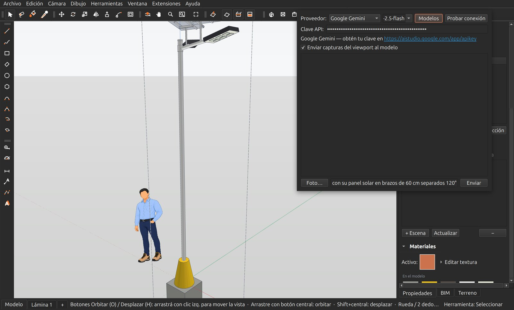
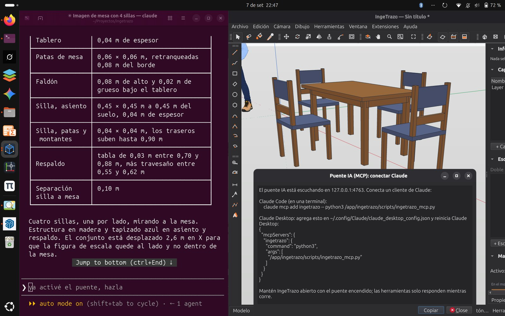

# Modelar con la IA

IngeTrazo tiene dos maneras de dejar que una inteligencia artificial modele por ti. En las dos, la IA **no toca la malla**: escribe una *receta* —revoluciones, extrusiones, Python sobre la API de acciones— y el motor determinista de IngeTrazo la ejecuta. Por eso valen las mismas garantías de siempre:

- **Cada acción de la IA es un paso de deshacer.** `Ctrl+Z` la quita entera.
- **Si su código falla, el documento vuelve solo** al estado anterior — nunca queda a medias.
- Cada receta pasa por el **guard de hermeticidad**: los sólidos que produce son sólidos de verdad, medibles e imprimibles.
- Lo que construye es geometría normal: grupos con nombre que editas a mano, pintas, acotas y llevas a las láminas.

| | Asistente IA (dentro de la app) | Puente MCP (desde Claude) |
|---|---|---|
| Dónde | **Extensiones ▸ Asistente IA** (`Ctrl+Mayús+A`) | **Extensiones ▸ Puente IA (MCP)** + Claude Code o Claude Desktop |
| Qué necesitas | Una clave API del proveedor que elijas (Groq tiene cuota gratis) u Ollama local | Claude Code o Claude Desktop instalados |
| Cómo hablas | Chat en español dentro de IngeTrazo, con foto opcional | Conversación en Claude; el agente dibuja en la app abierta |
| Quién ve el modelo | El asistente recibe capturas del viewport (opcional) | El agente pide capturas y consulta el modelo cuando quiere |

## El Asistente IA, paso a paso



1. **Extensiones ▸ Asistente IA** (o `Ctrl+Mayús+A`). Se abre un diálogo flotante sobre el modelo.
2. **Proveedor.** Elige uno o deja *Auto*: el prefijo de la clave lo detecta solo (`sk-ant-` es Anthropic, `gsk_` es Groq, `AIza` es Gemini…). Cada proveedor **recuerda su propia clave y su modelo**: si se te acaba la cuota de uno, cambias a otro en dos clics.

    | Proveedor | Clave | Ve imágenes | Notas |
    |---|---|:-:|---|
    | **Groq** | [console.groq.com/keys](https://console.groq.com/keys) | — | Cuota gratis generosa; muy rápido. Modelo por defecto `openai/gpt-oss-120b`. |
    | **Google Gemini** | [aistudio.google.com/app/apikey](https://aistudio.google.com/app/apikey) | ✔ | Cuota gratis. Por defecto `gemini-2.5-flash`. |
    | **Anthropic (Claude)** | console.anthropic.com | ✔ | De pago. |
    | **OpenAI** | platform.openai.com | ✔ | De pago. `gpt-4o` por defecto. |
    | **OpenRouter** | openrouter.ai | ✔ | Un solo lugar para muchos modelos. |
    | **DeepSeek** | platform.deepseek.com | — | Barato. |
    | **Ollama** | *(sin clave)* | según el modelo | **En tu propia máquina, sin internet.** Instala Ollama y deja la clave vacía; la URL por defecto es `http://localhost:11434`. |

3. **Clave API.** Pégala en el campo. Se guarda en tu perfil de usuario, nunca en el documento. El enlace bajo el campo te lleva a la página donde se obtiene.
4. **Modelo.** Vacío = el modelo por defecto del proveedor. **Modelos** lista los que tu clave puede usar de verdad; **Probar conexión** valida la clave antes de empezar.
5. **Enviar capturas del viewport al modelo.** Con un proveedor que *ve* (Claude, GPT, Gemini), después de cada paso el asistente recibe una imagen de lo que construyó, la mira y corrige solo. Con un modelo sin visión la casilla no hace daño: la imagen simplemente no se manda.
6. **Escribe el pedido y Enter.** Con medidas: *«dibuja una pileta circular de 4 m de diámetro y 0,6 m de alto, borde de 20 cm»*. El asistente contesta, muestra la receta que va a ejecutar y el resultado aparece en el modelo. Sigue la conversación para corregir: *«hazla 20 cm más alta»*, *«píntala de piedra»*.
7. **Foto…** adjunta una imagen (una foto de la pieza real, un croquis, una captura de un plano) y el modelo **reconstruye lo que muestra**. Dale las medidas reales en el mismo mensaje — la foto dice la forma; tú dices el tamaño.

!!! tip "Cómo pedir para que salga bien"
    - **Una pieza por mensaje**, con sus medidas: «poste de 4,5 m, tubo de 3"» funciona mejor que «un parque completo».
    - **Corrige en vez de repetir**: el asistente conserva el contexto y los grupos que creó; «el brazo es muy largo, déjalo en 60 cm» edita lo que hay.
    - Si la respuesta se corta, el asistente lo detecta y **pide la continuación solo**; si se pasa del límite de pasos, te avisa y con «continúa» sigue donde quedó.
    - **Ctrl+Z** con la ventana del modelo activa deshace la última receta entera.

!!! note "Qué se guarda dónde"
    Las claves y el proveedor viven en las preferencias de tu usuario (también se editan en **Ventana ▸ Preferencias ▸ Asistente IA**). El documento `.igz` solo guarda la geometría resultante: puedes compartirlo sin exponer ninguna clave.

## El puente MCP, paso a paso



El [Model Context Protocol](https://modelcontextprotocol.io) deja que un agente externo —Claude Code en la terminal o Claude Desktop— opere IngeTrazo **en vivo, con la app abierta**: dibuja, consulta y mira el modelo, y cada acción suya es un paso de deshacer.

1. **Enciende el puente**: **Extensiones ▸ Puente IA (MCP)**. IngeTrazo arranca un servidor local (solo en `127.0.0.1`, puerto 4763) y abre una ventana con las líneas exactas para tu sistema, con botón **Copiar**. El mismo menú lo apaga.
2. **Conecta tu cliente** — una sola vez:

    === "Claude Code (terminal)"

        ```bash
        # Windows (instalador o zip)
        claude mcp add ingetrazo -- "C:\Program Files\IngeTrazo\ingetrazo-mcp.exe"
        # Linux: AppImage, tar.gz, Flatpak o snap
        claude mcp add ingetrazo -- <ejecutable de IngeTrazo> --mcp
        # desde el código fuente
        claude mcp add ingetrazo -- python3 /ruta/a/app/scripts/ingetrazo_mcp.py
        ```

        No hace falta tener Python instalado: el paquete lleva el servidor MCP (`ingetrazo-mcp.exe` en Windows, `ingetrazo --mcp` en Linux).

    === "Claude Desktop"

        Pega esto en su archivo de configuración (`%APPDATA%\Claude\claude_desktop_config.json` en Windows, `~/.config/Claude/claude_desktop_config.json` en Linux) y reinicia Claude Desktop:

        ```json
        {
          "mcpServers": {
            "ingetrazo": {
              "command": "C:\\Program Files\\IngeTrazo\\ingetrazo-mcp.exe",
              "args": []
            }
          }
        }
        ```

3. **Pídele cosas**, con IngeTrazo abierto y el puente encendido: *«diseña una mesa de comedor de 1,60 × 0,90 con cuatro sillas de madera»*, *«dibuja el arco de la lámina E02 con todo su acero»*, *«muéstrame cómo quedó»*. El agente escribe recetas, las ejecuta, toma capturas para revisarse y te cuenta lo que hizo. Tú miras el resultado en la app en tiempo real y corriges como con cualquier colega: *«las sillas están muy pegadas»*.

Lo que el agente puede hacer:

| Herramienta | Qué hace |
|---|---|
| `run_python` | Ejecuta Python sobre el documento vivo, con `scene`, `selection`, `groups`, `QVector3D`… y los constructores `revolve(perfil)` y `extrude(contorno, z0, z1)`: una línea → un grupo sólido, suave y orientado. Un deshacer por llamada; si falla, no cambia nada. |
| `query_model` | Conteos, nombres de grupos y componentes, materiales, capas, caja envolvente. |
| `screenshot` | Renderiza el viewport real: el agente mira e itera. |
| `undo` / `redo` | La historia de siempre. |

!!! tip "Si Claude no responde"
    Comprueba que IngeTrazo sigue abierto **con el puente encendido** (el menú Extensiones lo muestra como *listening*), que la ruta del comando existe, y en Claude Desktop que el servidor aparece en Configuración ▸ Desarrollador ▸ MCP sin error. El servidor acepta un cliente a la vez y nunca escucha fuera de tu máquina.

## Lo que se ha hecho así

Los [ejemplos](primeros-pasos/ejemplos.md) que vienen con IngeTrazo se dibujaron en buena parte por el puente MCP: la luminaria solar (poste, dado tronco-cónico, cimiento y su acero), el arco de bienvenida de Yanque con todo su acero, farolas, letras y escultura, y el pedestal del campesino con su zapata. Ábrelos y mira los grupos: son recetas ejecutadas, no cajas negras.

!!! info "Otros modeladores venden esto por suscripción"
    En IngeTrazo la IA es libre: usas la clave que quieras (o un modelo local) y nada pasa por servidores de IngeTrazo. Sin IA, el programa funciona exactamente igual y sin internet.
