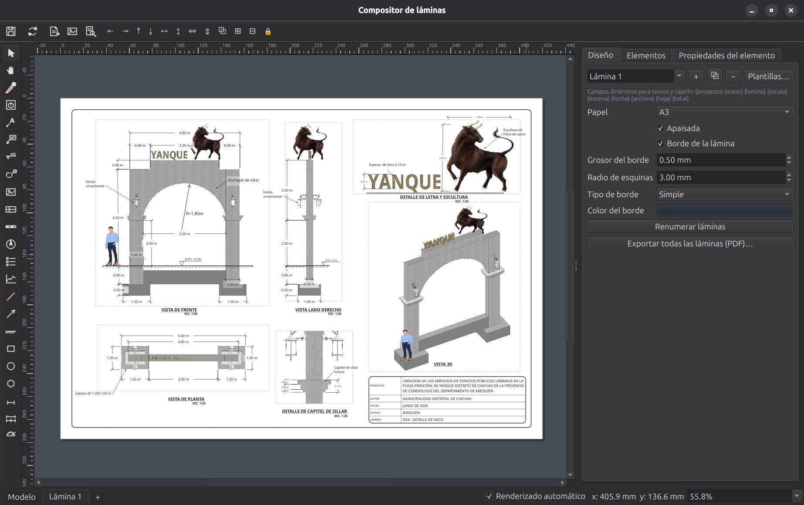

# Composición de láminas

El **compositor de láminas** convierte tu modelo en planos impresos sin salir de IngeTrazo — al estilo del compositor de QGIS o de LayOut: colocas **vistas del modelo a escala exacta** sobre una hoja, las acotas, les pones cajetín, y exportas PDF vectorial.

Se abre desde **Archivo ▸ Compositor de láminas**.

## La ventana

- **Canvas central**: la hoja, con sombra y márgenes. Zoom con `Ctrl+rueda` o con el combo de la barra de estado (*Ajustar a hoja*, *Ajustar a anchura*, porcentajes — 100 % es el **tamaño real del papel** en tu pantalla).
- **Barra de herramientas izquierda**: seleccionar, mano, pincel de formato, marco de vista, texto, etiqueta con guía, nivel, llamada de detalle, imagen, cajetín, escala gráfica, norte, leyenda, perfil de terreno, línea, flecha, rectángulo, elipse, polígono, cota, cotas en cadena y cota angular.
- **Panel derecho** (redimensionable): gestor de láminas, lista de items y propiedades del item seleccionado.

## Hojas

- Tamaños **A4 a A0**, horizontal o vertical, con margen configurable.
- **Varias láminas por documento**: `+` crea, `⧉` duplica (hereda cajetín y márgenes — ideal para mantener el estilo del expediente), `−` elimina, y *Renumerar láminas* actualiza los L-01, L-02… de los cajetines.
- Todo se guarda **dentro del `.igz`**, con su propio deshacer. Compones una vez; cada revisión del modelo es reabrir y re-exportar.

## Los items

Cada cosa sobre la hoja es un item: se mueve arrastrando (con imanes a márgenes, centro y otros items), se redimensiona por la esquina (el cursor lo indica), y tiene sus propiedades en el panel.

Con **clic derecho** sobre cualquier item:

- **Traer al frente / Subir / Bajar / Enviar al fondo** — el orden de apilado (dibuja un rectángulo de fondo, mándalo atrás, y pon todo encima).
- **Bloquear** — el item queda visible pero inamovible (perfecto para el marco de la hoja); el candado 🔒 lo marca en la lista.
- **Organizar** — alinear y distribuir la selección (con dos o más items), agrupar y desagrupar (`Ctrl+G`, `Ctrl+Mayús+G`), duplicar (`Ctrl+D`). La barra «Organizar» con estos mismos botones está oculta por defecto; clic derecho sobre la barra de herramientas para mostrarla.

Sigue con **[Marcos de vista y escala](marcos.md)** — el corazón del compositor.
