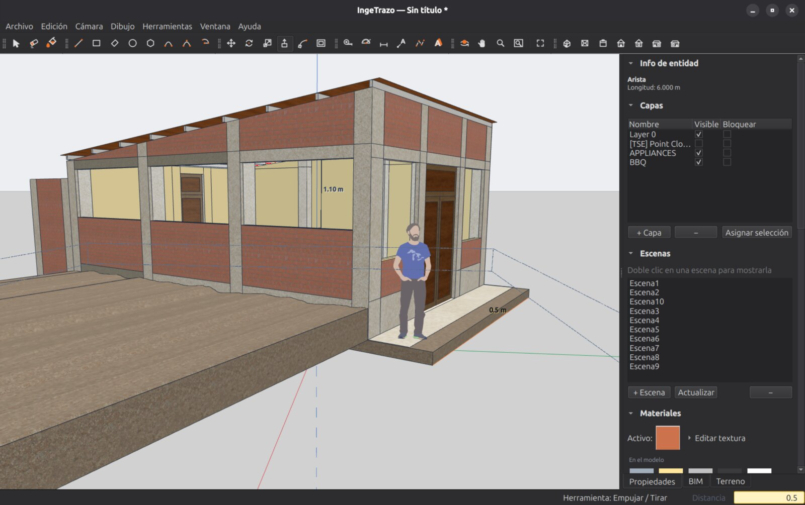

# Editar la geometría

## Empujar / Tirar

**`U`** — la herramienta que convierte dibujos en volúmenes. Clic sobre una cara, mueve, teclea la distancia y Enter.

- Sobre una cara de un sólido: lo **engrosa o adelgaza**.
- Sobre un dibujo dentro de una cara: **abre un vano** al llegar a la cara opuesta.
- El material de la cara **viaja con la forma**: empujar una cara pintada da un volumen pintado.
- Sobre una **copia de un componente** desde fuera, el empuje edita la definición: todas las copias reciben el mismo empuje (clic derecho ▸ **Hacer único** antes, si quieres cambiar solo esa).
- IngeTrazo verifica cada empuje: si la operación fuera a dejar un sólido roto, la **rechaza** con un aviso — nunca corrompe el modelo.

## Seleccionar

**Espacio** activa Selección.

| Gesto | Qué hace |
|---|---|
| Clic | Selecciona lo que tocas. Doble clic sobre una cara toma la cara y sus aristas; triple clic, todo lo conectado. |
| Arrastre izquierda → derecha | **Ventana**: solo lo que queda dentro del cuadro. |
| Arrastre derecha → izquierda | **Cruce**: todo lo que el cuadro toca. |
| `Mayús` + clic | **Alterna**: lo que estaba seleccionado sale, lo que no estaba entra. La regla de SketchUp — es la forma de quitar una arista o una cara de una selección grande. |
| `Ctrl` + clic | **Añade** siempre. |
| `Mayús` + `Ctrl` + clic | **Quita** siempre. |
| Clic en el vacío | Vacía la selección; con un modificador, la deja como está. |
| `Esc` | Deselecciona todo. |

La caja de selección usa los mismos modificadores, y toma también grupos, componentes y guías.

## Mover, Rotar, Escalar, Voltear

| Herramienta | Atajo | Notas |
|---|---|---|
| **Mover** | `M` | Selecciona y arrastra; teclea la distancia (o `X;Y;Z` para un desplazamiento en tres ejes). Mueve puntos, aristas, caras, grupos o selecciones mixtas. Las flechas del teclado bloquean un eje; `Ctrl` mueve una **copia**. Imanta contra caras de otros objetos. |
| **Rotar** | `Q` | Como el transportador de SketchUp: el disco se colorea según el plano que infiere del hover; las **flechas** o `Mayús` fijan el plano; clic en el pivote, clic en la referencia, arrastra el ángulo o tecléalo. Marcas cada 15° con imantación. `Ctrl` gira una **copia**; arrastrar desde el centro define un eje de plegado. Acepta pendientes `3:12`. |
| **Escalar** | `S` | El cajón amarillo de SketchUp con sus manijas: **esquina** = escala uniforme, **arista** = dos ejes, **cara** = un eje. El ancla es el lado opuesto; con `Ctrl` escalas desde el **centro**; `Mayús` fuerza uniforme. En el VCB: un factor (`2`), factores por eje (`1;2;1`), un tamaño absoluto con unidad (`3m`, `2'`) o un factor **negativo para espejar**. Se puede re-teclear después de soltar. Sirve sobre geometría suelta, grupos, componentes e imágenes a la vez. |
| **Voltear** | — | Herramientas ▸ Voltear (la herramienta Flip de SketchUp): tres planos translúcidos rojo, verde y azul sobre la selección; clic en uno la espeja por ese plano. `Ctrl` voltea una **copia**. También en el menú contextual. |

## Borrador, medir y comprobar

| Herramienta | Atajo | Notas |
|---|---|---|
| **Borrador** | `E` | Clic o arrastre sobre aristas. Borrar la arista disuelve las caras que dependían de ella. **`Mayús` + Borrador oculta** el trazo en lugar de borrarlo. |
| **Medir** (cinta métrica) | `T` | Mide entre dos puntos y crea **guías** de construcción. |
| **Transportador** | `Mayús+H` | Mide ángulos y crea guías angulares. |
| **Eliminar guías** | — | Edición ▸ Eliminar guías, cuando ya cumplieron su función. |

## Ocultar aristas

Para que una superficie hecha de varias caras se vea continua sin borrar nada:

- Selecciona las aristas y **Edición ▸ Ocultar aristas** (o clic derecho ▸ Ocultar aristas), o pasa el Borrador con `Mayús`.
- **Edición ▸ Mostrar todas las aristas** las devuelve (todas las del contexto en que estás: fuera de un grupo, las sueltas; dentro, las del grupo).
- Una arista oculta no se puede clicar hasta mostrarla; las láminas y los exports la respetan.

## Grupos y componentes

- **Crear grupo** (`Ctrl+G`): la selección se vuelve un grupo — geometría aislada que no se «pega» al resto. **Doble clic** para entrar a editarlo; `Esc` o clic afuera para salir. Mientras editas, el resto del modelo se **atenúa** (Cámara ▸ Resto del modelo al editar).
- **Deshacer grupo** (`Ctrl+Mayús+G`) lo disuelve. **Unir grupos** funde varios en uno.
- **Crear componente…** (`G`): la selección se vuelve una **definición** con nombre y una primera instancia. Copiarla (`Ctrl+C`/`Ctrl+V`, o Mover con `Ctrl`) crea instancias que **comparten la definición**: editas una y cambian todas ([detalle](organizacion.md#componentes-editas-uno-cambian-todos)). Mover una instancia no duplica geometría.
- **Hacer único** (clic derecho) desliga una copia para editarla sola.
- Copiar y pegar funciona entre documentos; el pegado muestra una **vista previa sólida** siguiendo al cursor, con colores y texturas, y estampa una sola vez.

## Deshacer

`Ctrl+Z` / `Ctrl+Mayús+Z` (o `Ctrl+Y`). **Toda** operación pasa por el historial — puedes retroceder siempre, incluso importaciones completas y lo que dibuja la [IA](../ia.md).
