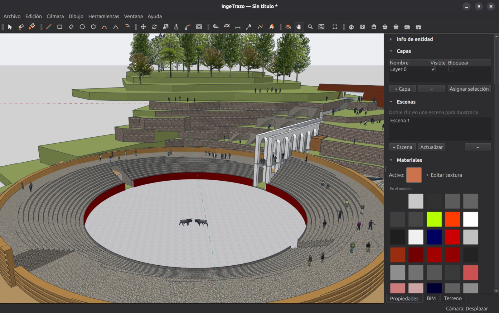

# La interfaz

La ventana de IngeTrazo tiene cuatro zonas:

- **Viewport 3D** (el centro): aquí vives. Todo se dibuja y se edita directamente sobre el modelo.
- **Barras de herramientas**: dibujo, edición, cámara y anotación. Cada botón muestra su atajo de teclado al pasar el mouse.
- **Bandeja lateral** (derecha): materiales, capas, escenas, información de entidad, BIM y Terreno. Se pliega por paneles.
- **Barra de estado** (abajo): mensajes de la herramienta activa, el **VCB** (campo de medidas) y — si el proyecto está georreferenciado — la lectura continua de coordenadas UTM.

## Navegar el modelo

| Acción | Cómo |
|---|---|
| **Orbitar** | Botón central del mouse (arrastrar), o la herramienta Orbitar |
| **Paneo** | `Shift` + botón central, o la herramienta Mano |
| **Zoom** | Rueda del mouse; `Z` para zoom por arrastre; Zoom Ventana para encuadrar una región |
| **Encuadrar todo** | Zoom Extensión (en la barra de cámara) |
| **Vistas estándar** | Menú Cámara ▸ Vistas estándar: superior, frontal, lateral, isométrica… |
| **Perspectiva / paralela** | `P` alterna la proyección |

!!! tip "El VCB: medidas exactas por teclado"
    Mientras dibujas, **escribe el número y Enter** — no hace falta hacer clic en ningún campo. Una línea de 3.50 m: activa Línea, clic en el origen, orienta, teclea `3.50` y Enter. Funciona en casi todas las herramientas: distancias, radios, ángulos, cantidades de lados.

## El modo oscuro

La interfaz usa tema oscuro siempre, pensado para que el viewport (oscuro por diseño) y los paneles no choquen. No hay que configurar nada.

## Idioma

Ventana ▸ Idioma permite cambiar entre español e inglés. El manual usa los nombres en español.
