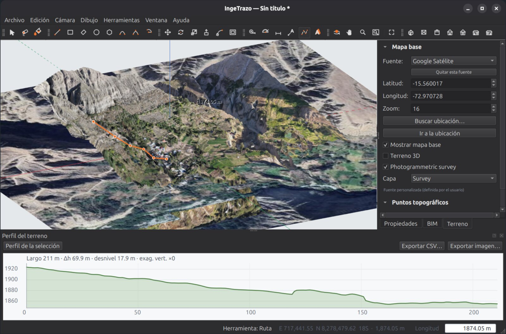

# Levantamiento de dron (WebODM)

Si vuelas tu sitio con dron y procesas en **WebODM/ODM**, IngeTrazo importa la malla fotogramétrica texturizada como base de trabajo — tu terreno real, con sus texturas reales, en su posición UTM real.

## Importar

1. Archivo ▸ Importar ▸ **Levantamiento fotogramétrico (ODM)…**
2. Elige el modelo texturizado del export de ODM (`odm_texturing/odm_textured_model_geo.obj`).
3. IngeTrazo lee la georreferenciación del propio export y coloca el levantamiento **donde corresponde**, con altitudes reales.

Qué hace por ti:

- **Posición y cotas reales**: el ancla UTM del export se respeta; la referencia vertical se toma del **pie del levantamiento**, así toda cota que leas es altitud real del sitio.
- **Texturas adaptadas a tu GPU**: los atlas gigantes de ODM (hasta 24 576 px) se reescalan automáticamente a lo que tu tarjeta soporta, con caché para que la segunda carga sea instantánea.
- **Se guarda dentro del `.igz`**: mueves el documento a otra PC y el levantamiento viaja con él — ya no depende de la carpeta del export.
- **Su propia capa**: el import crea la capa *Levantamiento*; puedes apagarla sin tocar tu modelo.

## Trabajar sobre el vuelo

- Es geometría de **referencia** (display-only): se ve, se mide y se consulta, pero no se mezcla con tus sólidos.
- La herramienta **Ruta** consulta la elevación del levantamiento en vivo (~20 µs por consulta): el perfil longitudinal sale de **tu vuelo**, no del satélite de 30 m.
- En vista superior + proyección paralela el trazado sobre el relieve no tiene paralaje: la herramienta Ruta entra sola en esa vista.

!!! note "Sobre la precisión vertical"
    Sin puntos de control (GCP), la altitud del dron es GNSS (elipsoidal) y puede diferir unos metros del nivel medio del mar. El CSV del perfil lo declara en su encabezado. Para expedientes con tolerancia estricta, vuela con GCP.

!!! tip "Rendimiento"
    Un levantamiento real de ~360 000 triángulos y 21 atlas carga en ~2 s y orbita fluido. Si el tuyo es mucho mayor, considera la versión decimada que ODM también exporta.
